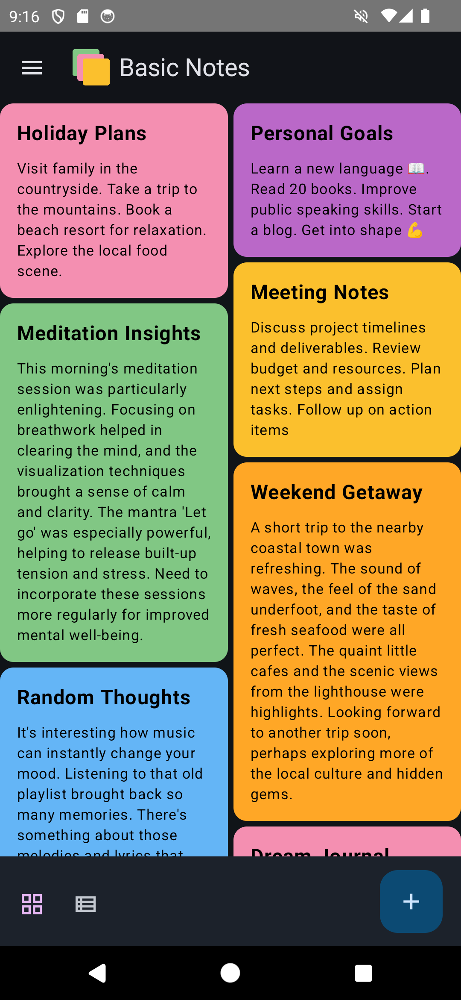
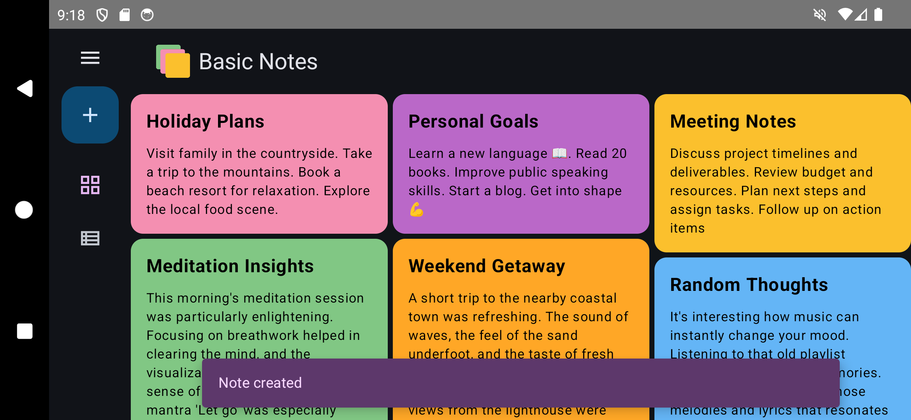
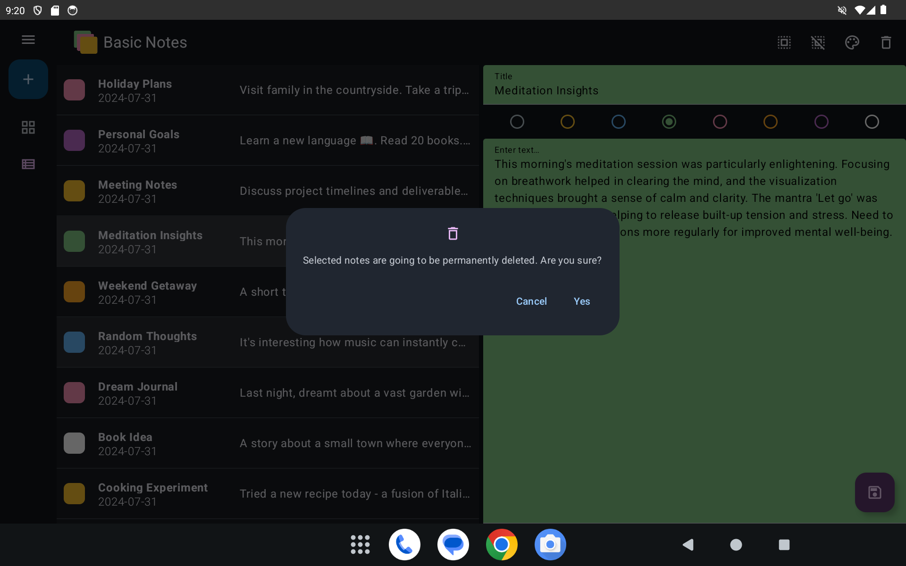
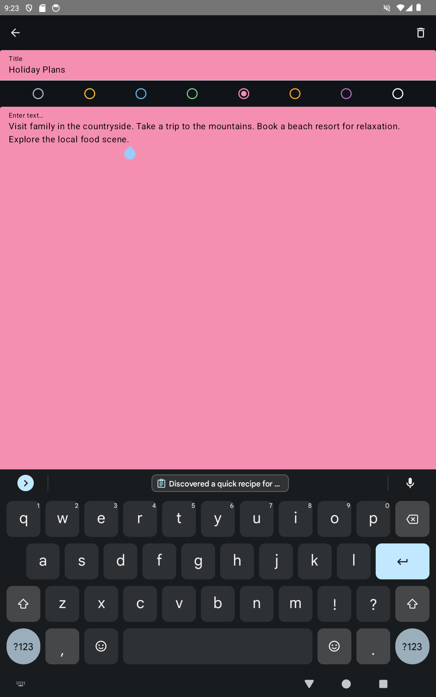

# Basic Notes

Note-taking app for Android.

Features:

- Grid view and list view.
- Adapts to different screen sizes according to best practices.
- Local database for notes.

Technical notes:

- Automated instrumentation tests and unit tests (in progress).
- UI with Jetpack Compose
- Dependency injection with Hilt
- Room database
- Layered architecture

# Screenshots

